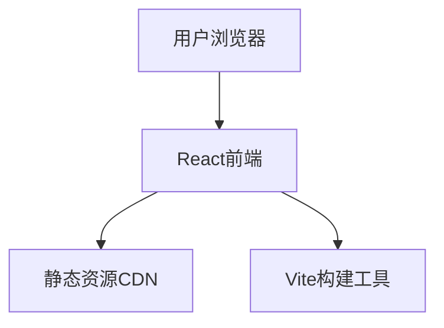

## 1. Architecture Design


## 2. Technology Description
- Frontend: React@18 + TypeScript + tailwindcss@3 + vite@6
- Initialization Tool: vite-init
- Backend: None (纯静态网站)
- Database: None (纯静态网站)

## 3. Route Definitions
| Route | Purpose |
|-------|---------|
| / | 首页，展示所有内容 |

## 4. API Definitions (不适用)
本项目为纯静态网站，无需后端API

## 5. Server Architecture Diagram (不适用)
本项目为纯静态网站，无需后端服务器架构

## 6. Data Model (不适用)
本项目为纯静态网站，无需数据库

## 7. Component Structure
```
src/
├── components/
│   ├── Hero.tsx           # 首页Hero区域
│   ├── HistorySection.tsx # 历史文化区
│   ├── SpecialtySection.tsx # 特产区
│   ├── TourismSection.tsx # 旅游景点区
│   ├── FoodSection.tsx    # 美食区
│   ├── Footer.tsx         # 页脚
│   └── Navbar.tsx         # 导航栏
├── data/
│   └── content.ts         # 所有静态内容数据
├── App.tsx                # 主应用组件
├── main.tsx               # 入口文件
└── index.css              # 全局样式
```

## 8. Styling Guidelines
- 使用Tailwind CSS进行样式开发
- 自定义颜色主题：艾草绿、金色、米色、深褐色
- 响应式断点：sm(640px), md(768px), lg(1024px), xl(1280px)
- 使用CSS动画实现滚动效果和悬停效果

## 9. Performance Optimization
- 图片使用WebP格式
- 懒加载图片
- 代码分割
- 最小化bundle体积

## 10. Deployment
- 静态网站部署
- 推荐平台：Vercel、Netlify、GitHub Pages